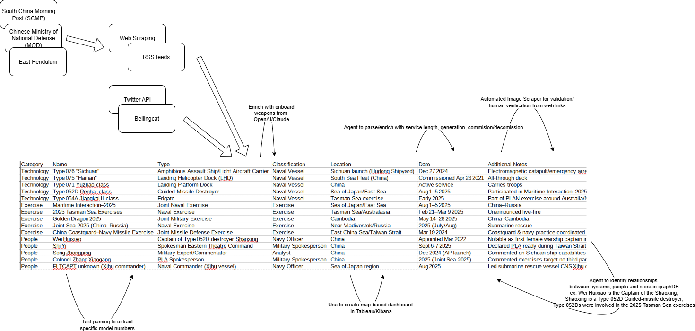

# 🔍 OSINT Source Evaluation: Chinese Naval Technologies

This document identifies and evaluates key publicly available sources for gathering open-source intelligence (OSINT) on Chinese naval technologies. The goal is to support further HUMINT, CI, CP, and FI analysis by structuring credible, diverse, and strategically valuable sources.

---

## 📌 Table: OSINT Sources Overview

| Source | Example Mentioned | Extracted Entity | Entity Type |
|--------|--------------------|------------------|-------------|
| **South China Morning Post (SCMP)** | *"Chinese navy commissions new giant ship for amphibious operations in South China Sea.”* | `Type 075 Landing Helicopter Dock (LHD)` | Naval Vessel Class |
| **Chinese Ministry of National Defense (MOD)** | *"PLA Navy conducts combat training in East China Sea.”* | `East China Sea`, `PLA Navy (PLAN)` | Exercise Region, Military Org |
| **East Pendulum** | *"Type 055: Analysis of China's most advanced destroyer class.”* | `Type 055 Renhai-class Destroyer`, `Dalian Shipyard` | Vessel Class, Shipyard |
| **Twitter/X OSINT Community** | Post on submarine launch at Huludao by @CovertShores | `Type 096 Tang-class SSBN`, `Huludao Shipyard` | Submarine Class, Shipyard |
| **Bellingcat** | *"Tracking China’s Naval Footprint in the Indian Ocean…”* | `Yuan Wang-class tracking ships`, `Ream Naval Base (Cambodia)` | Support Vessel, Foreign Naval Base |

---

## 🧠 Source Trustworthiness, Importance, and Distinction

### 📰 South China Morning Post (SCMP)
- **Trustworthy:** Established Hong Kong-based outlet with bilingual editorial access.
- **Important:** Reports on Chinese military affairs with regional insight and journalistic standards.
- **Distinct:** Provides media framing and narrative context, useful for sentiment analysis and international messaging.

---

### 🛡️ Chinese Ministry of National Defense (MOD)
- **Trustworthy:** Official Chinese government source.
- **Important:** Primary source for announcements on military operations, drills, and strategic objectives.
- **Distinct:** Offers insight into **state-controlled narratives**, terminology, and doctrinal framing.

---

### ⚙️ East Pendulum
- **Trustworthy:** Independent blog authored by a French-speaking OSINT analyst with a focus on China.
- **Important:** Provides **engineering-level analysis** of shipyards, vessel types, and satellite verification.
- **Distinct:** Highly technical and niche; focuses exclusively on Chinese defense advancements.

---

### 📡 Twitter/X OSINT Community
- **Trustworthy:** Curated from respected analysts like `@CovertShores`, `@detresfa_`, and others with verifiable track records.
- **Important:** Delivers **real-time observations** of shipbuilding, deployments, and naval movement using satellite imagery.
- **Distinct:** Excellent for **event-driven intelligence** and ongoing monitoring.

---

### 🕵️ Bellingcat
- **Trustworthy:** Globally respected OSINT investigative collective.
- **Important:** Performs methodologically sound, multi-source geospatial investigations.
- **Distinct:** Emphasizes **long-form, high-trust analysis** over speed or frequency.

---

## 🧭 Summary: Comparative Strengths

| Source      | Strength                                 | Weakness                            |
|-------------|------------------------------------------|-------------------------------------|
| SCMP        | Public sentiment + regional context      | Possible editorial bias/censorship  |
| MOD         | First-hand announcements + terminology   | Highly propagandistic               |
| East Pendulum | Technical depth + high specificity       | Less frequent updates; in French    |
| Twitter/X   | Real-time data + community insights      | Requires verification, scattered    |
| Bellingcat  | Investigative depth + cross-source validation | Slower publication pace             |

---

While I could not get Flowise to query my various API keys and link together the structured data, I sketched out my initial process.

See below for an example workflow leveraging OSINT sources, their outputs, and future mechanisms for enriching and visualizing the data. Data is structured in a CSV for easy parsing and integration with diverse tools like Python, pandas, Tableau, Elastic/Kibana, AI agents, etc. As it grows, it would make sense to restructure the database to one with better scalability, read/write accessibility and speed, and possibly a graph database like Neo4j.

